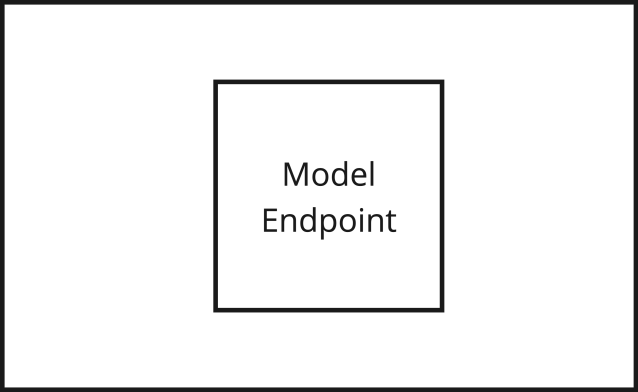
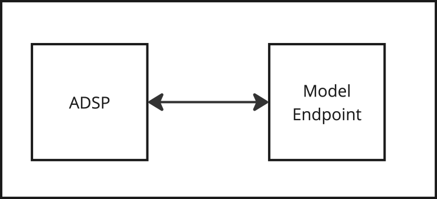

# Model Serving

Model Serving refers to exposing ML models as network services (REST APIs) for inference/prediction operations.  Instances of models being served are Endpoints.  Endpoints can be run within ADSP Deployments, or externally within containers or (local contexts).  While almost all requirements can be handled with native `mlflow models serve` functionality, if reloading of stage and alias tracked models is required then the mlflow-adsp plugin must be used.

## Requirements

### Runtime

* Anaconda Enterprise Project & Command
  * Model serving can be executed occur within a Project, or through a Deployment using a Project Command.
* Container
  * Model serving can can be executed within a Docker container.
* Direct
  * Model serving can run from the command line within local, development, or other scenarios.

### OS Dependencies

* This is part of the runtime environment or container definition and includes architecture.

### Python Environment

* The model will be exercised within the context of a Python environment. There are several methods by which this can occur based on the dependency management configuration selected.

### Model Artifacts

* The physical file assets which are loaded.  MLflow defines a MLmodel format.  See [MLflow Models](https://www.mlflow.org/docs/latest/models.html) for details.  This includes Python runtime environment definitions whether or not we leverage them.  If leveraging a MLflow Tracking Server then this would also include the related network access and configurations.

## Deployment

### Anaconda Data Science Platform

* It is recommended to use Anaconda Enterprise’s Project paradigm for dependency management, and resource profiles for compute and hardware configuration.  

The CLI can used to invoke the functionally from the Terminal or from a Project Command.  When configured as a Project Command, a Deployment can be created allowing the model to be shared.

### Kubernetes / Docker

* The serving container is expected to be deployed into Kubernetes.
* A Helm chart will be used to deploy and configure the container.  Either the generic one provided, or the customer can use their own based on specific needs.
* A container registry to store the build container will be required to store the image.

## Model Serving Scenarios

### Anaconda Data Science Platform

This can be accomplished with the Anaconda Data Science Platform using Project Deployments. Either native MLflow or the plugin can accomplish this based on needs.
* Using `local` dependency management within MLflow or the plugin will allow the ADSP Project to handle dependencies for the model.
* Using `conda` or another supported environment manager for the model dependencies is also possible but required additional configuration.

### Kubernetes / Docker

This can be accomplished by containerizing the model runtime and deploying into a Kubernetes cluster.

### High-Level Scenarios

#### I - Local Model / Local Dependencies

* Supports Reloadable Models: No

    ##### Description
    
    * Endpoint contains the complete runtime (OS, Dependencies, Model). 
    
      * Leveraging persistent environments with the Anaconda Data Science Platform allows for deployments to start up with all dependencies needed and load the model stored with the Project.

#### II - Local Model / Remote Dependencies

* Supports Reloadable Models : No

    ##### Description
    
    Endpoint contains the model, but the dependencies must be resolved and installed at runtime from an external provider.
    
    In this context, the external provider here could be repositories within the Anaconda Data Science Platform, or external sources (based on configuration).
    
    * If a persistent environment is not configured for this Project within the Anaconda Data Science Platform then they will be resolved when the Deployment starts.

#### III - Remote Model / Local Dependencies

* Supports Reloadable Models: Yes**

    ** So long as the runtime dependencies do NOT need to change, this scenario can be used to manage reloadable models.
    
    ** Requires the use of MLflow managed environment dependencies.

    ##### Description
    
    Endpoint sources the model from an external source, but the dependencies to execute the model are already present in the runtime environment. In this context ADSP is providing access to the MLflow Tracking Server and the dependencies.

    Leveraging persistent environments with the Anaconda Data Science Platform allows for deployments to start up with all dependencies needed and load the model tracking within the MLflow Tracking Server.
    
    * Fast and reliable runtime setup and fairly robust support for model updates which don’t need dependencies changed.

#### IV - Remote Model / Remote Dependencies

* Supports Reloadable Models: Yes**

    ** Requires the use of MLflow managed environment dependencies.

    ##### Description
    
    Endpoint sources the model and dependencies at runtime.
    
    * Fully dynamic runtime.  Both the environment and the model are brought together at runtime.  The flexibility comes with the cost of the environment resolution and installation.

## Anaconda Enterprise

The Anaconda Data Science Platform is providing access to dependencies, a hosted MLflow Tracking Server instance, and compute when using Project Deployments.dx

Models can be loaded from any supported URI, which is a superset of choices including tracking servers.  See [mlflow.sklearn — MLflow Documentation](https://www.mlflow.org/docs/latest/python_api/mlflow.sklearn.html#mlflow.sklearn.load_model) and [Concepts — MLflow Documentation](https://www.mlflow.org/docs/latest/concepts.html#artifact-locations) for additional details.

## Endpoints

* When running an endpoint using the plugin the the native mlflow serve is leveraged for the following tasks:

  1. Source the model from the provided URI.
  2. Resolving runtime dependencies if configured to do so.
  3. Exposing the model as a REST API.

* Native MLflow serving does not provide a mechanism to reload a model if the version changed for Stage and Alias tracked models.
* `mlflow-adsp serve` provides a mechanism to manage the `mlflow serve` process and allow monitoring for version changes when leveraging a reloadable model URI.

Endpoint consumption details:
* [MLflow Models — MLflow Documentation](https://www.mlflow.org/docs/latest/models.html#id68)

# Docker Containerization

| These two solutions require the use of a docker daemon to complete builds. |
|:--------------------------------------------------------------------------:|

These two solutions require the use of a docker daemon to complete builds.  Building natively within ADSP is not currently supported and remote access to a docker host would be required in order to leverage these solutions.

There are several methods to create Docker images for use outside of the Anaconda Data Science Platform.  In addition to the ones below custom images can be also be leveraged.

1. anaconda-project dockerize
   1. Reference: [Creating Docker Images — Anaconda Project Documentation](https://anaconda-project.readthedocs.io/en/latest/user-guide/tasks/docker-image.html)

| Pros                                                                                                     | Cons                                                                                          |
|----------------------------------------------------------------------------------------------------------|-----------------------------------------------------------------------------------------------|
| Anaconda Enterprise (anaconda-project) Project Deployments can be directly converted into Docker images. | Roadblock: Anaconda Enterprise user space does not have Docker, or container registry options |
| Endpoint has all runtime dependencies.                                                                   | Requires docker daemon                                                                        |
|                                                                                                          | Requires a container registry to push to.                                                     |
|                                                                                                          | Access to the custom docker registry will be required at all deployment locations.            |
|                                                                                                          | The model will need to be manually downloaded by the user and included.                       |

2. mllfow models build-docker / generate-dockerfile
   1. References:
      1. [mlflow-models-build-docker](https://www.mlflow.org/docs/latest/cli.html?highlight=dockerfile#mlflow-models-build-docker)
      2. [mlflow-models-generate-dockerfile](https://www.mlflow.org/docs/latest/cli.html?highlight=dockerfile#mlflow-models-generate-dockerfile)

   2. MLflow CLI provides the ability to create a docker file based on the model, or provide a Dockerfile which would be used to build the image.

| Pros                                   | Cons                                                                                          |
|----------------------------------------|-----------------------------------------------------------------------------------------------|
| Endpoint has all runtime dependencies. | Roadblock: Anaconda Enterprise user space does not have Docker, or container registry options |
|                                        | Requires docker daemon                                                                        |
|                                        | Requires a container registry to push to                                                      |
|                                        | Access to the custom docker registry will be required at all deployment locations             |

| This solution does not require a Docker Daemon |
|:----------------------------------------------:|

3. mlfow-adsp template container & CI/CD
   1. The plugin provides a template Dockerfile which can be used to build images which serve models.

| Pros                                                                    | Cons                                                                              |
|-------------------------------------------------------------------------|-----------------------------------------------------------------------------------|
| Does not require Docker.  A generic image can be generated and provided | Only supports a remote model / remote dependency deployment scenario              |
|                                                                         | Access to the custom docker registry will be required at all deployment locations |
|                                                                         | Access to MLFlow Tracking will be required at all deployment locations            |
